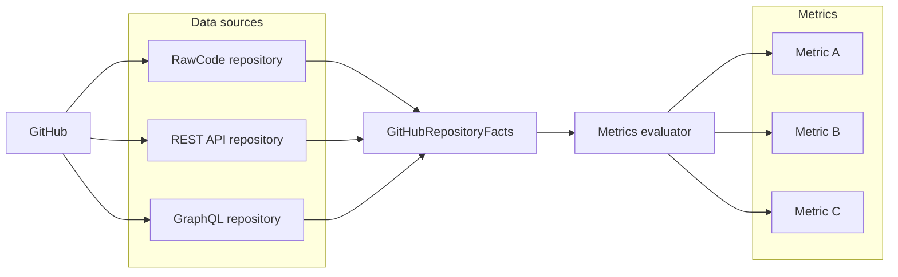

# 001 - Metrics architecture

## Status

Accepted

## Context

We want to score the health of a GitHub repository (review latency, issue
throughput, contribution rhythm, code quality, etc.). The data needed to answer
these questions lives in several places:

- The **GitHub API** (REST and GraphQL) for PRs, issues, reviews, and metadata.
- The **raw files** of the repository, available cheaply once `HEAD` is cloned.

We need an architecture that lets us add new metrics over time without
re-plumbing data access each time, while keeping the cost of fetching data
explicit and controllable.

## Decision

Separate **data gathering** from **metric evaluation**.

1. A set of **repositories** each pull from a single source (raw cloned files,
   REST API, GraphQL API) and contribute to a shared, immutable
   `GitHubRepositoryFacts` object. These are plain facts, with no scoring logic.
2. A set of **metrics** each take `GitHubRepositoryFacts` as input and produce a
   metric result. Metrics share a common protocol/interface and never fetch data
   themselves.
3. A **metrics evaluator** orchestrates the process: it takes the gathered
   `GitHubRepositoryFacts` and runs each registered metric against those facts,
   collecting the individual metric results into the overall scorecard.

This decoupling means adding a metric is just adding a new check against existing
facts. When a metric needs data we do not yet collect, we extend the relevant
facts repository once and every metric benefits.

## Consequences

**Positive**

- New metrics scale out cheaply: they only consume facts.
- The raw cloned `HEAD` yields many facts "for free" without extra API calls.
- Clear separation makes both sources and metrics independently testable.

**Negative / trade-offs**

- A metric requiring new data forces adding API fetching to a facts repository,
  which can increase API usage and rate-limit pressure.
- Facts must be gathered up front, so some data may be collected even when no
  metric consumes it yet.
